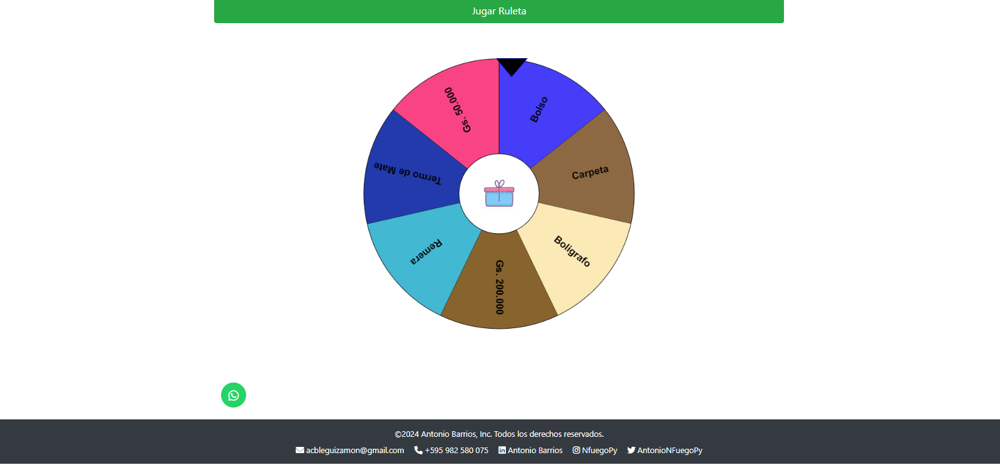

# Proyecto de Ruleta de Sorteos

Este es un proyecto de una ruleta de sorteos que permite realizar rifas de diversos premios. La ruleta se genera dinámicamente y permite seleccionar un elemento ganador al azar.

## Captura de Pantalla



## Estructura del Proyecto


## Instalación

1. Clona este repositorio:
   ```bash
   git clone https://github.com/tu-usuario/ruletavirtual.git

2. Paso para ejecutar
cd ruletavirtual

Abre index.html en tu navegador para ver la ruleta en acción.

## Uso
Abre index.html en tu navegador.
Haz clic en "Jugar Ruleta" para girar la ruleta y seleccionar un ganador.
La ruleta mostrará el premio seleccionado y permitirá reiniciar el juego.

## Tecnologías Utilizadas
HTML
CSS (Bootstrap 4.0.0-beta y SweetAlert)
JavaScript (jQuery, Winwheel.js, TweenMax.js)

## CONTACTO

- Author - [Antonio Barrios](https://www.linkedin.com/in/acbleguizamon?utm_source=share&utm_campaign=share_via&utm_content=profile&utm_medium=android_app)
- Instagram - [NfuegoPy](https://www.instagram.com/nfuegopy?igsh=cmNqNXB6NHEyN2V1)
- Twitter - [@AntonioNfuegoPy](https://x.com/AntonioNFuegoPy?t=jV-D9Q7I2-EBipCj74r_eg&s=09)